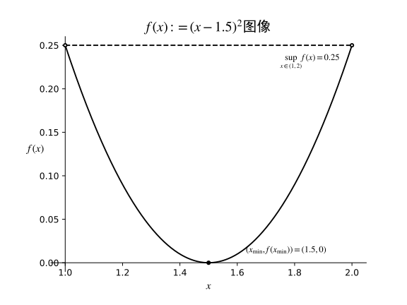
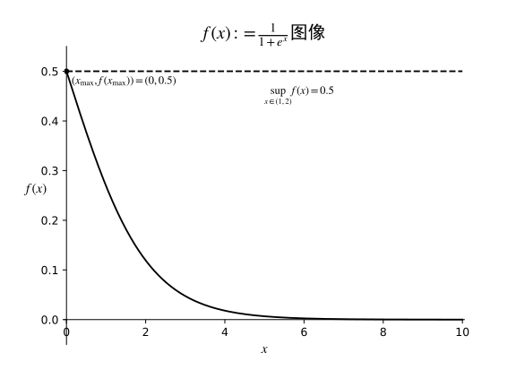
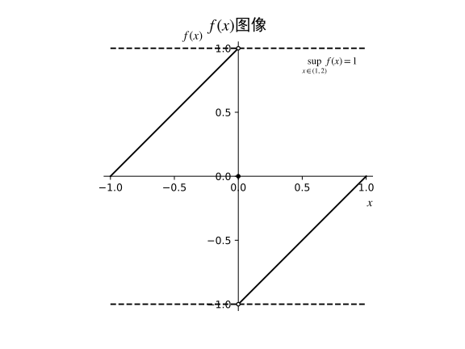
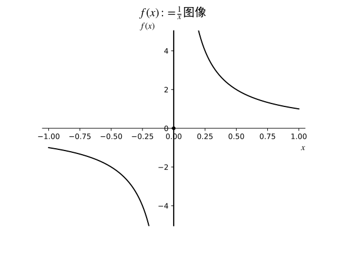

# 9.6 最大值原理

## 定义

1. （9.6.1 实值函数的界？）设$X$是$\mathbb R$的一个子集，并设$f:X\to\mathbb R$是一个函数。若存在一个实数$M$使得对所有$x\in X$均有$f(x)\leq M$成立，那么我们称$f$是__有上界的__；若存在一个实数$M$使得对所有$x\in X$均有$f(x)\geq -M$成立，那么我们称$f$是__有下界的__；若存在一个实数$M$使得对所有$x\in X$均有$|f(x)|\leq M$成立，那么我们称$f$是__有界的__。

   （注：一个函数如果是有界的，当且仅当它同时是有上界的与有下界的；另外，若$f:X\to\mathbb R$是有界的，当且仅当它的象$f(x)$是[定义9.1.22](..\..\第9章\pdf\实分析 9.1 实直线的子集.pdf)下的有界集合；对于连续函数，若其定义域是一个有界的闭区间，那么它必然是有界的，见命题9.6.3）

2. （9.6.5 最大值与最小值）设$X$是$\mathbb R$的一个子集，$f:X\to\mathbb R$是一个函数，并且设有$x_0\in X$。若对所有$x\in X$都有$f(x_0)\geq f(x)$，那么我们称$f$在$x_0$处到达它的__最大值__；若对所有$x\in X$都有$f(x_0)\leq f(x)$，那么我们称$f$在$x_0$处到达它的__最小值__。

   （注：如果一个函数在某点处达到它的最大值，那么它一定有上界，相应的，如果它在某点处达到它的最小值，那么它一定有下界。最大值与最小值的概念目前仍然是__全局性__的，在[定义10.2.1](..\..\第10章\pdf\实分析 10.2 局部最大值、局部最小值以及导数.pdf)中我们将给出其局部性的形式）

---

## 命题

1. （9.6.3 有界闭区间上的连续函数？）设$a<b$都是实数，并且设$f:[a,b]\to\mathbb R$是$[a,b]$上的连续函数，那么$f$是一个有界函数。
1. （9.6.7 最大值原理）设$a<b$都是实数，并且设$f:[a,b]\to\mathbb R$是$[a,b]$上的连续函数。那么$f$在某一点$x_{\text{max}}\in[a,b]$处达到最大值；在某一点$x_{\text{min}}\in[a,b]$处达到最小值。

   （注：我们简写$\sup\{f(x):x\in[a,b]\}$记为$\displaystyle\sup_{x\in[a,b]}f(x)$，并类似地定义$\displaystyle\inf_{x\in[a,b]}f(x)$。于是最大值原理断定了$\displaystyle m:=\sup_{x\in[a,b]}f(x)$是一个实数，并且它是$f$在$[a,b]$上的__最大值__，即至少存在一个点$x_{\text{max}}\in[a,b]$使得$f(x_{\text{max}})=m$并且对任意$x\in X$都有$f(x_{\text{max}})\geq f(x)$，类似地，也有$\displaystyle\inf_{x\in[a,b]}f(x)$是$f$的__最小值__）

---

## 课后习题

##### 9.6.1 举例说明

###### (a) 函数$f:(1,2)\to\mathbb R$是连续且有界的，并且在某一点处达到最小值，但是没有最大值

> 考虑令$f$映射关系有$f(x):=(x-1.5)^2$，其连续性是显然的，并且我们显然有$|f(x)|\leq 0.25$对任意$x\in(1,2)$都成立。显然有$x=1.5\in(1,2)$处$f$有最小值，但是对任意的$x\in(1,2)$，我们都有：
> $$
> \forall y\in(1,1.5-|x-1.5|),(y-1.5)^2\geq x
> $$
> 因此不存在最大值。
>
> 函数的图像如下：
>
> 

###### (b) 函数$f:[0,+\infty)\to\mathbb R$是连续且有界的，并且在某一点处达到最大值，但是没有最小值

> 考虑令$f$映射关系有$\displaystyle f(x):=\frac{1}{1+e^{x}}$，其连续性是显然的，并且我们显然有$|f(x)|\leq 0.5$对任意$x\in[0,+\infty)$都成立。由于$e^{x}\geq 1$对任意$x\in[0,+\infty)$都成立，从而在$x=0\in [0,+\infty)$处取得$f$有最大值为$\displaystyle\frac{1}{2}$，但是对任意的$x\in[0,+\infty)$，我们都有：
> $$
> \forall y\in(x,+\infty),\frac{1}{1+e^y}<\frac{1}{1+e^x}
> $$
> 因此不存在最小值。
>
> 函数图像如下：
>
> 

###### (c) 函数$f:[-1,1]\to\mathbb R$是有界的，既没有最大值也没有最小值

> 考虑令$f$映射关系有：
> $$
> f(x):=
> \begin{cases}
> 1+x&\text{if}\;x<0\\
> 0&\text{if}\;x=0\\
> -1+x&\text{if}\;x>0\\
> \end{cases}
> $$
> 从而显然我们有对任意$x\in[-1,1]$有$|f(x)|\leq 1$，因此$f$是有界的，但是对于任意的$x\in[-1,1]$，我们都有：
> $$
> \begin{array}{c}
> \forall y\in(-|x|,0),f(y)>f(x)\\
> \forall z\in(0,|x|),f(z)<f(x)
> \end{array}
> $$
> 从而$f$不存在最大值与最小值。
>
> 函数图像如下：
>
> 

###### (d) 函数$f:[-1,1]\to\mathbb R$既没有上界也没有下界

> 考虑令$f$映射关系有：
> $$
> f(x):=
> \begin{cases}
> \frac{1}{x}&\text{if}\;x\ne 0\\
> 0&\text{if}\;x=0
> \end{cases}
> $$
> 显然$f$不存在上界与下界，并且$f$在$[-1,1]$上都是有定义的。
>
> 函数图像如下：
>
> 

##### 解释为什么你构造的例子都不违背最大值原理（注：仔细阅读假设条件）

> 上面四种情况都是不满足最大值原理的条件的，可以看到：
>
> * (a)和(b)的$f$都不是定义在闭区间上的函数。
> * (c)的$f$不满足连续。
> * (d)的$f$实际上是必然不连续的，因为连续的话$f$就应当是有界的（命题9.6.3）。
>
> 于是可以看到，这些例子都不是满足最大值原理的函数。

---

## 本节相关跳转

[实分析 9.1 实直线的子集](..\..\第9章\pdf\实分析 9.1 实直线的子集.pdf)

[实分析 10.2 局部最大值、局部最小值以及导数](..\..\第10章\pdf\实分析 10.2 局部最大值、局部最小值以及导数.pdf)
